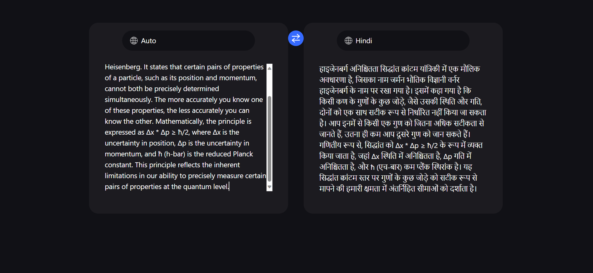

# Live Language Translator

## Description

This project is a live language translator that utilizes the Google Translate API. It is built using React for the frontend, Tailwind CSS for styling, and JavaScript for the logic. The translator allows users to input text in one language and get real-time translations in their desired language.

## Tech Stack

- **React**: The frontend framework for building the user interface.
- **Tailwind CSS**: A utility-first CSS framework for styling the application.
- **JavaScript**: The programming language used for the logic and interaction with the Google Translate API.

## Screenshots

